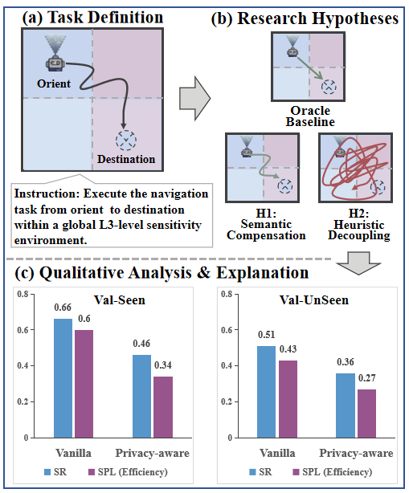
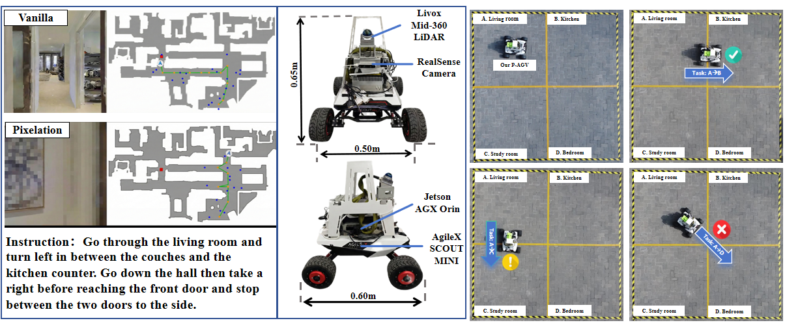

# 🔐 SPINE Framework
(Secure Privacy Integration in Next-generation Embodied AI)

<h3 align="center">
  <!-- <strong>⭐ Official Repository for the SPINE Framework ⭐</strong> -->
</h3>

---

  <b>🔥 This is the repository for evaluation and case studies of the SPINE framework.</b>
    
  We propose <b>SPINE</b> (Secure Privacy Integration in Next-generation Embodied AI), 
  a unified privacy-aware framework that treats privacy as a dynamic control signal governing cross-stage coupling throughout the entire Embodied AI lifecycle. 

---

## 🔍 Table of Contents
- [📖 1. Introduction](#1-introduction)
- [🏗️ 2. Taxonomy](#2-taxonomy)
- [💬 3. SPINE Framework Design](#3-spine-framework-design)
- [👁️ 4. Case Study](#4-case-study)
- [🎥 5. Demonstration Video](#5-demonstration-video)
- [🧭 6. Related Projects](#6-related-projects)

---

## 📖 1. Introduction 
Embodied AI (EAI) systems are rapidly transitioning from laboratory benchmarks to real-world domestic and occupational environments. However, existing solutions exclusively demonstrate advancements within isolated stages, which may create a systemic privacy crisis when prioritizing task utility at the expense of data privacy. We propose **SPINE**, a unified framework to navigate this fundamental tradeoff by integrating privacy-utility optimization throughout the agent's workflow.

---

## 🏗️ 2. Taxonomy 
Our evaluation framework categorizes EAI privacy into four interdependent stages that define the information flow of an embodied agent:
1. **Instruction Understanding**: Focuses on local sanitization of user commands and intent masking.
2. **Environment Perception**: Addresses source-level modality restrictions and anonymization techniques.
3. **Action Planning**: Incorporates privacy cost maps and trajectory privacy to protect user routines.
4. **Physical Interaction**: Ensures data minimality through in-memory execution and secure wipe protocols.

---

## 💬 3. SPINE Framework Design 
SPINE functions as a dynamic orchestration layer that adjusts the agent's computational behavior based on a detected privacy classification matrix ranging from L1 Public to L4 Restricted. Crucially, this tiered approach ensures that privacy constraints are enforced holistically, preventing systemic leakage caused by treating stages as isolated components.

---

## 👁️ 4. Case Study 

We perform a detailed case study on embodied navigation within the SPINE framework, evaluating a long-range navigation task transitioning from Public (L1) to Restricted (L4) zones.

### 4.1. Task Definition, Hypotheses & Results

  
   
  <em>Fig. 1: (a) Task Definition; (b) Research Hypotheses (H1 & H2); (c) Qualitative Analysis & Explanation.</em>

* **H1: Semantic Compensation**: High-level intent serves as a semantic anchor, allowing the agent to maintain a baseline success rate even when visual data is sanitized.
* **H2: Heuristic Decoupling**: Loss of visual landmarks causes a logic break, forcing the navigation policy to regress from efficient heuristics into stochastic search patterns.
* **Key Findings**: In experimental scenarios, Success Rate (SR) decreased by 30.3%, while Success weighted by Path Length (SPL) plummeted by 43.3% in restricted settings.

### 4.2. Experimental Design (Simulator & Real-World)

  
   
  <em>Fig. 2: Hardware platform (AgileX SCOUT MINI) and real-world quadrant deployment.</em>

* **Hardware Platform**: AgileX SCOUT MINI mobile base.
* **Sensing Suite**: Livox Mid-360 LiDAR for spatial mapping and RealSense Camera for visual input.
* **Computing Unit**: Jetson AGX Orin module for real-time inference and navigation control.

---

## 🎥 5. Demonstration Video 

  https://github.com/user-attachments/assets/8a64ad80-4395-4259-b723-28573621ed77

---

## 🧭 6. Related Projects 
The following table outlines representative Vision-and-Language Navigation (VLN) projects relevant to embodied navigation research. It is intended as a starting point for discussing capability, deployment setting, dataset dependence, and the current lack of explicit system-level privacy mechanisms.

<table>
  <thead>
    <tr>
      <th>Name</th>
      <th>Website</th>
      <th>Features</th>
      <th>Datasets</th>
      <th>Open Source?</th>
    </tr>
  </thead>
  <tbody>
    <tr>
      <td><b>R2R</b></td>
      <td><a href="https://aclanthology.org/D18-1367/">Link</a></td>
      <td>Classic discrete VLN Fine-grained instructions Offline training</td>
      <td><b>Matterport3D</b> 90 buildings 21,567 instructions</td>
      <td>Yes</td>
    </tr>
    <tr>
      <td><b>VLN-CE</b></td>
      <td><a href="https://jacobkrantz.github.io/vlnce/">Link</a></td>
      <td>Continuous 3D VLN Collision-aware actions Habitat execution</td>
      <td><b>Matterport3D mesh in Habitat</b> 90 indoor scenes 21,567 instructions</td>
      <td>Yes</td>
    </tr>
    <tr>
      <td><b>CVDN</b></td>
      <td><a href="https://cvdn.dev/">Link</a></td>
      <td>Dialog-based navigation QA history Cooperative grounding</td>
      <td><b>MP3D-based scenes</b> 83 houses 2,050 dialogs and 7k+ trajectories</td>
      <td>Yes</td>
    </tr>
    <tr>
      <td><b>HA-R2R</b></td>
      <td><a href="https://lpercc.github.io/HA3D_simulator/">Link</a></td>
      <td>Human-aware VLN Dynamic activities Collision-sensitive evaluation</td>
      <td><b>MP3D with simulated humans</b> 90 buildings 21,567 human-like instructions</td>
      <td>Yes</td>
    </tr>
    <tr>
      <td><b>VLN-PE</b></td>
      <td><a href="https://openaccess.thecvf.com/">Link</a></td>
      <td>Physically embodied VLN Cross-morphology evaluation Collision and fall constraints</td>
      <td><b>MP3D and 3DGS-Lab-VLN</b> Train/val-seen/val-unseen episodes 441 / 111 / 1,287</td>
      <td>Yes</td>
    </tr>
    <tr>
      <td><b>TOUCHDOWN</b></td>
      <td><a href="https://openaccess.thecvf.com/">Link</a></td>
      <td>Street-view VLN Outdoor grounding Spatial description resolution</td>
      <td><b>Google Street View NYC graph</b> 29,641 panoramas 61,319 edges</td>
      <td>Yes</td>
    </tr>
    <tr>
      <td><b>InternData-N1</b></td>
      <td><a href="https://huggingface.co/">Link</a></td>
      <td>Unified VLN format Multi-scene and multi-morphology data Quality filtering</td>
      <td><b>3k+ scenes</b> 830k VLN data VLN-CE, VLN-PE, and VLN-N1 in LeRobot v2.1</td>
      <td>Yes</td>
    </tr>
  </tbody>
</table>
